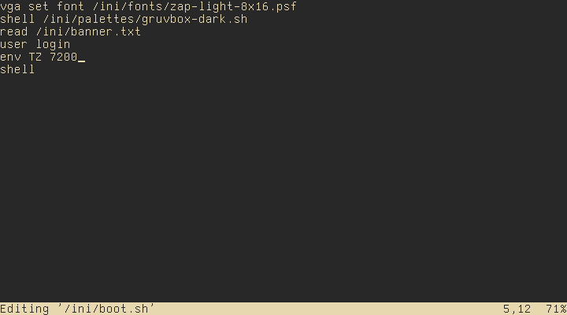

# MOROS Editor

MOROS Editor is a minimal, keyboard-driven text editor with intuitive
shortcuts for navigation, editing, and file management.

## Commands

- `Ctrl` + `A` to move cursor to beginning of line
- `Ctrl` + `B` to move cursor to end of file
- `Ctrl` + `C` to quit
- `Ctrl` + `D` to cut (delete) line
- `Ctrl` + `E` to move cursor to end of line
- `Ctrl` + `F` to find string in file
- `Ctrl` + `K` to kill buffer
- `Ctrl` + `N` to find next string in file
- `Ctrl` + `O` to open buffer
- `Ctrl` + `P` to paste (put) line
- `Ctrl` + `Q` to quit
- `Ctrl` + `T` to move cursor to beginning of file
- `Ctrl` + `W` to write to file
- `Ctrl` + `X` to write to file and quit
- `Ctrl` + `Y` to copy (yank) line

- `Ctrl` + `Tab` to load next buffer
- `Ctrl` + `Shift` + `Tab` to load previous buffer
